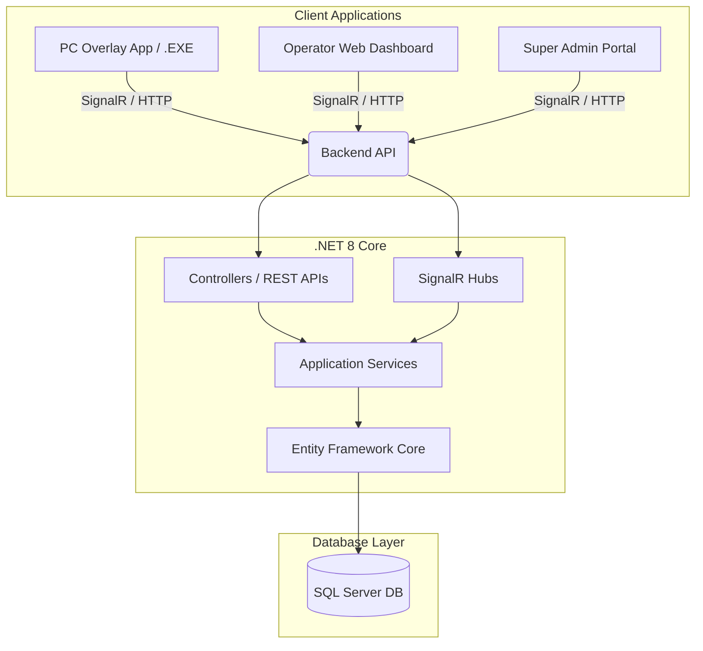

# Apple Esports ERP - The Complete System Manual

**Version:** 1.0.0
**Document Scope:** Comprehensive System Architecture, Database Schema, API Reference, UI/UX Standards, User Manuals, and Future Scalability Roadmaps.

---

## RECENT UPDATES & BUG FIXES (June 2026)

### 1. Food Order Placement Fix
- **Issue**: PC overlay orders successfully saved the `FoodOrder` but omitted `FoodOrderItem` entries due to a missing object mapper in the backend logic.
- **Fix**: The `PlaceFoodOrder` method in `PcOverlayHub.cs` was updated to accurately map incoming `FoodItemPayload` properties to their `FoodOrderItem` entity equivalents (`InventoryId`, `ItemName`, `Quantity`, `UnitPrice`, `TotalPrice`).

### 2. Session Timer Sticking Fix
- **Issue**: The countdown timer on the overlay screen sometimes failed to start if the UI mounted prior to a successful session data fetch.
- **Fix**: Re-evaluated the dependency array of the real-time countdown `useEffect` hook in `OverlaySocketContext.jsx` to depend strictly on `sessionData.sessionId` and `sessionData.sessionStatus === 'active'` instead of a generic truthy check on the object.

### 3. Operator Call Notification UI
- **Issue**: The "Call Operator" feature resulted in a minor, easily missed toast notification rather than an actionable operator alert.
- **Fix**: Upgraded the `OperatorCall` to use the primary `AnimatePresence` big modal UI card in `GlobalNotificationListener.jsx`. Added an explicit "Acknowledge" button to clear the alert. Implemented `speechSynthesis` to provide verbal warnings to operators.

### 4. Dynamic Time Extension & Walk-in Billing
- **Issue**: The operator dashboard calculated time extensions and walk-in bill estimates using a hardcoded base rate of `₹100/hr`, ignoring variable PC monitor rates (e.g., PS5 or 240Hz PCs).
- **Fix**: Adjusted `GlobalNotificationListener.jsx` to perform API calls fetching the exact `ratePerHour` applied to the specific `pcId` (from `/api/public/session/pc/${pcId}` or `/api/public/pcs/${pcId}`) and multiplying dynamically for correct expected billing amounts in backend `SessionExtendDto`.

---

## COMPREHENSIVE END-TO-END SYSTEM WORKFLOWS (BY ROLE) (FLOW)

The system supports three distinct operational roles. Below is the complete start-to-end lifecycle and feature access for each.

### 1. SUPER ADMIN WORKFLOW

**Goal**: Full system oversight, multi-branch management, global revenue tracking, and configuration.

**A. Authentication & Entry**
1. **Login**: The Super Admin navigates to the global login gateway (`/login/super-admin`).
2. **Authentication**: Enters master credentials. The system authenticates against global permissions.
3. **Dashboard Access**: Redirects to the Global Dashboard (not tied to any specific branch).

**B. Global Management & Monitoring**
1. **Cross-Branch Oversight**: Can view aggregate revenue, active sessions, and PC statuses across all branches (e.g., Adajan, Citylight).
2. **Operator Management**: Creates, edits, or revokes operator accounts and assigns them to specific branches.
3. **Inventory & Menu**: Manages the global food and beverage menu, updating prices and stock that reflect in all branches.
4. **System Configuration**: Edits global rules (base PC rates, monitor Hz pricing multipliers, tax configurations).

**C. Auditing & Reporting**
1. **Shift Logs**: Reviews End-of-Day (EOD) and shift reports submitted by operators.
2. **Audit Trails**: Tracks overriding actions (e.g., operator canceling a reservation or applying a manual discount).
3. **Revenue Analytics**: Generates date-range filtered reports for gross gaming, food sales, and tax liabilities.

---

### 2. OPERATOR WORKFLOW

**Goal**: Manage a specific branch's day-to-day operations, including PC sessions, billing, walk-ins, and shift cash handling.

**A. Authentication & Shift Start**
1. **Branch Selection**: Navigates to `/login/operator` and selects their assigned branch (secured by backend data isolation).
2. **Login**: Enters personal PIN/Password.
3. **Shift Initialization**: The system logs the exact time, operator ID, and cash float. The shift becomes "ACTIVE".

**B. Day-to-Day Operations**
1. **Walk-in Handling**:
   - Customer arrives; Operator checks the **PC Status Grid** for available (gray) computers.
   - Operator clicks an available PC, inputs Customer Name and Duration (or Pay-As-You-Go), and hits **Start Session**.
   - PC status turns **Active (Green)**, and the system sends a SignalR command to unlock the user's PC.
2. **Reservation Management**:
   - Operator creates future bookings. PC turns **Reserved (Purple)**.
   - If a walk-in tries to take a reserved PC, the system pops up a warning preventing the session unless manually overridden.
   - When the customer arrives, the operator converts the reservation to an Active Session.
3. **Remote PC Control**: Operator can Reboot, Shutdown, or Lock any PC remotely from the dashboard.

**C. Requests & Food Orders**
1. **Overlay Notifications**: Listens (via `GlobalNotificationListener.jsx`) for incoming SignalR events.
2. **Time Extensions**: A popup alerts the operator that PC-X wants 30 more minutes. Operator clicks **Approve**; the system dynamically calculates the new cost based on the PC's monitor Hz rate and extends the session.
3. **Food Orders**: Operator receives order tickets in the Kanban board. Moves tickets from "Pending" -> "Preparing" -> "Delivered". Charges are added to the active session's bill.
4. **Call Operator**: A modal popup appears with a text-to-speech voice alert if a user needs physical assistance at their desk.

**D. Checkout & Shift End**
1. **Billing**: Customer finishes. Operator opens the bill, reviews gaming + food charges, applies discounts if applicable, logs the payment method (Cash/UPI), and closes the bill. The PC auto-locks and returns to Idle.
2. **EOD / Shift End**: Operator closes their shift, reconciles physical cash with the system's expected cash, and submits the shift report to the Super Admin.

---

### 3. USER (GAMER) WORKFLOW

**Goal**: Seamless gaming experience with in-seat ordering and session management, powered by a lightweight PC overlay.

**A. Session Start**
1. **Idle State**: PC is locked by the Client Overlay, showing the branch logo and a "Please see the front desk" message.
2. **Activation**: Upon Operator starting the session, the backend broadcasts a SignalR `SessionUpdated` event.
3. **Unlock**: The PC overlay unlocks the Windows environment, allowing the user to launch games.

**B. Active Session Experience**
1. **Overlay Access**: The lightweight widget (designed for minimal RAM/CPU usage) sits on the screen.
2. **Real-time Tracker**: Shows exact remaining time syncing dynamically with the server.
3. **Self-Service Actions**:
   - **Order Food**: Opens a digital menu. User adds items to the cart and places the order. It sends a payload directly to the operator's Kanban board.
   - **Extend Time**: User selects +30 mins or +1 hr. The request pauses locally until the Operator approves it.
   - **Call Operator**: Sends an urgent ping to the front desk.
   - **View Bill**: User can check their current running total (Gaming + Food) at any time.

**C. Session End**
1. **Warning**: At 5 minutes remaining, the overlay pulses to warn the user.
2. **Auto-Lock**: When time expires (or if the operator ends the session manually), the PC Overlay instantly re-locks the Windows environment.
3. **Logout**: User leaves the desk, proceeds to the counter to pay the final bill.

---

## Table of Contents
1. [System Architecture & Tech Stack](#1-system-architecture--tech-stack)
2. [Database Schema & Entities](#2-database-schema--entities)
3. [API & SignalR Communication Layer](#3-api--signalr-communication-layer)
4. [Frontend & UI/UX Design System](#4-frontend--uiux-design-system)
5. [Hardware Installation & Setup Guide](#5-hardware-installation--setup-guide)
6. [User Workflows (Walk-in & Member)](#6-user-workflows-walk-in--member)
7. [Operator Dashboard Manual](#7-operator-dashboard-manual)
8. [Future Roadmap: Cloud, Security & Desktop Packaging](#8-future-roadmap-cloud-security--desktop-packaging)

---

## 1. System Architecture & Tech Stack

Apple Esports ERP is designed as a centralized Management System operating on a Client-Server model, heavily emphasizing real-time state synchronization across physical locations (Branches).

### 1.1 Tech Stack Detail
- **Frontend Framework:** React.js 18 + Vite (for rapid Hot Module Replacement during development).
- **Frontend State & Routing:** React Router v6, React Context API (`AuthContext`, `SocketContext`, `BranchContext`).
- **Styling:** Custom CSS built on utility classes (Tailwind-style) with a strict focus on Glassmorphism, Neon lighting, and smooth animations via `framer-motion`.
- **Backend Framework:** .NET 8 Web API.
- **ORM:** Entity Framework Core using Code-First Migrations.
- **Real-Time Engine:** Microsoft SignalR (WebSockets with Long-Polling fallbacks).
- **Authentication:** JWT (JSON Web Tokens) with Role-Based Claims (User, Operator, Admin, Super Admin).

---

## 2. Database Schema & Entities

The system uses a highly normalized relational database structure designed to handle multi-branch logic.

### Core Entities
- **`Branch`**: Represents a physical café location. Contains `Id`, `Name`, `Address`, `Status`. (All other operational entities map back to a Branch).
- **`Pc`**: Represents physical hardware. Contains `Id`, `PcNumber`, `PcName`, `BranchId`, `State` (Idle, Active, Offline), `IpAddress`, `MacAddress`.
- **`Operator` / `User` / `Member`**:
  - `Operator`: Café staff. Bound to a specific `BranchId`. Uses JWT auth.
  - `Member`: Registered customers with prepay wallets (`GamingBalance`, `FoodBalance`).
- **`PricingProfile`**: Dynamic hourly rate configurations bound to specific branches.

### Operational Entities
- **`Session`**: The core billing unit. Created when a PC unlocks. Contains `PcId`, `OperatorId`, `MemberId`, `StartTime`, `EndTime`, `GamingAmount`, `FoodAmount`, `State` (Active, Completed).
- **`FoodOrder` & `FoodOrderItem`**: Tracks F&B purchases tied directly to active `Sessions`.
- **`Shift` & `CashRegister`**: Handles operator accountability. A Shift starts when an operator logs in, opening a Cash Register. All cash transactions map to the active register to allow End-of-Day (EOD) auditing.

---

## 3. API & SignalR Communication Layer

### 3.1 RESTful API Endpoints (Controllers)
- **`PublicController`**: Unauthenticated endpoints for kiosk operations.
  - `GET /api/public/branches`: Lists all branches.
  - `GET /api/public/branches/{id}/pcs`: Fetches all PCs for hardware binding.
  - `POST /api/public/pcs/{pcId}/decline-walkin`: Rejects walk-in requests.
- **`SessionsController`**: Protected by `[Authorize]`.
  - `POST /api/sessions/start`: Creates a session, calculates cost, assigns shift, and signals PC unlock.
  - `POST /api/sessions/{id}/stop`: Closes session and signals PC lock.
- **`FoodOrdersController`**: Manages kitchen queues and bill additions.

### 3.2 SignalR Hubs (Real-Time State)
Because the system controls physical hardware, HTTP polling is too slow. SignalR maintains persistent, sub-millisecond bidirectional communication.
- **`PcOverlayHub`**: The Hub that physical PCs connect to. Sends Heartbeats, Activity Events, and Walk-in Requests.
- **`NotificationHub`**: Broadcasts alerts (like `WalkinSessionRequest`) to Operator Dashboards.
- **`BillingHub`**: Broadcasts `BillingUpdated` when a session adds food or extends time, forcing the Operator dashboard to re-render the bill live.
- **`PcStatusHub`**: Tracks PC online/offline status and transitions from Idle to Active.

---

## 4. Frontend & UI/UX Design System

### 4.1 Visual Identity
The system entirely rejects standard "bootstrap" designs. It aims for a **Premium Cyber-Esports Aesthetic**.
- **Colors:** Deep obsidian backgrounds (`#0a0a0c`), slate borders (`#1f1f23`), and highly saturated Neon Accents (Red `#dc2626`, Green `#22c55e`).
- **Glassmorphism:** Heavy use of `backdrop-blur-xl` and semi-transparent `rgba()` backgrounds to create depth over abstract blurred glowing orbs.
- **Typography:** `font-heading` (sans-serif bold/wide for titles), `font-body` (for readability), `font-mono` (for numbers, bills, and IDs).

### 4.2 Reusable Components
- `PageHeader.jsx`: Standardized title and breadcrumb system for dashboards.
- `ActiveBillsList.jsx`: Real-time scrolling grid of running sessions.
- `useToast`: A custom context for displaying floating, auto-dismissing success/error notifications at the bottom right.

### 4.3 Frontend Routing Hierarchy

The React frontend utilizes `react-router-dom` v6 for strict route protection and role-based access. Below is the complete mapping of the application's routing architecture.

#### Public & Authentication Routes (Unprotected)
- `/` - **LandingGatewayPage:** The main entry portal for the entire system. Routes between User, Operator, Admin, and Super Admin.
- `/login/operator` - Operator login portal.
- `/login/admin` - Admin login portal.
- `/login/superadmin` - Super Admin login portal.
- `/unauthorized` - Fallback for denied role access.
- `/setup-pc` - Hardware Binding page for installers to map a physical PC to a Branch/PC ID.

#### Kiosk & PC Overlay Routes
- `/user/select` - Walk-in vs Member selection (Web fallback).
- `/user/member-login` - Member authentication screen.
- `/user/limited` - Walk-in request screen.
- `/user/member-portal` - Portal for logged-in members (Top-ups, stats).
- `/pc-overlay/:pcId/*` - **UserOverlayApp:** The locked-down desktop overlay for dedicated PCs. Bypasses standard routing once initialized.

#### Protected Application Shell (`/app/*`)
All routes under `/app` are wrapped by `ProtectedRoute`, requiring valid JWT authentication and specific role claims (`OPERATOR`, `ADMIN`, `SUPER_ADMIN`).

**Operations Dashboards:**
- `/app/billing` - **BillingCounterPage:** Handles walk-in approvals, active sessions, and payments.
- `/app/sessions` - **SessionsPage:** Historical and active session log.
- `/app/reservations` - **ReservationsPage:** Managing advance PC bookings.
- `/app/food-orders` - **FoodOrdersPage:** The Kitchen/Bar ticket management system.

**Finance Dashboards:**
- `/app/cash-register` - Live physical cash drawer management.
- `/app/cash-desk` - All cash transactions.
- `/app/online-desk` - Card/UPI/Digital transactions.
- `/app/wallet-desk` - Member wallet top-ups.
- `/app/eod` - **EodDashboardPage:** End of Day shift closure and discrepancy flagging.

**Management & Admin Dashboards:**
- `/app/members` - Member CRM (Create, ban, view history).
- `/app/menu-editor` - Food & Beverage catalog editor.
- `/app/dashboard` - **MainDashboardPage:** High-level metrics and heatmaps.
- `/app/reports` - **ReportsPage:** (Admin/Super Admin only) Exportable financial data.
- `/app/pc-status` - **PcStatusPage:** (Admin/Super Admin only) Hardware monitoring and forced overrides.
- `/app/settings` - **SettingsPage:** (Admin/Super Admin only) Pricing profiles and branch settings.

---

## 5. Hardware Installation & Setup Guide

When opening a new café or adding a new computer, the software must be "Hardware Bound" so the system knows exactly which PC is which.

### Step-by-Step Installation:
1. Run the `.exe` (or open the local URL on the physical machine). The `LandingGatewayPage` appears.
2. Click **USER**. Since the machine is unconfigured, it routes to `/setup-pc`.
3. **Select Branch:** The installer selects the physical café location from the dropdown (fetched securely via API).
4. **Select PC:** The installer selects the specific PC ID (e.g., "PC-04") from the branch list.
5. Click **Save Configuration**.
6. **Background Action:** The system saves the exact Database GUID of that PC to `localStorage` (as `dedicatedPcId`). 
7. The application instantly reloads and bypasses the gateway, locking the screen into the **PC Overlay** (`PcLockScreen.jsx`). This PC is now fully operational.

---

## 6. User Workflows (Walk-in & Member)

The physical PC is locked, blocking access to Windows. The user sees the Apple Esports User Selection screen.

### 6.1 The Walk-in Flow (Guest)
1. User clicks **"Walk-in User"**.
2. User enters their Name (e.g., "John") and selects a duration (e.g., "1 Hr").
3. User clicks **"Request Session"**.
4. The frontend invokes `requestWalkinSession` on the `PcOverlayHub`.
5. The screen enters a "Waiting for Operator" pulsing animation.
6. Once the Operator approves (see section 7), the backend pushes an `UnlockSession` command. The React app triggers the Electron shell to drop the lock screen, revealing Windows.

### 6.2 The Member Flow (Prepaid)
1. User clicks **"Member Login"**.
2. User inputs Mobile/ID and Password.
3. System authenticates via REST API and returns `MemberProfile` (including Wallet Balance).
4. User selects a duration. System calculates `Expected Cost = (Duration / 60) * BaseRate`.
5. If `WalletBalance >= Expected Cost`, the user clicks Start.
6. The system deducts the wallet natively, bypasses Operator approval, and instantly unlocks the screen.

---

## 7. Operator Dashboard Manual

The Operator accesses the system via a web browser at the reception desk.

### 7.1 Managing Walk-in Requests
- **Alert System:** When a Walk-in request fires from a PC, the Operator's `BillingCounterPage` intercepts the `Alert` on the `NotificationHub`.
- **UI Popup:** A glowing alert box drops down containing the User's Name, Time, and PC Number.
- **Approval:** Clicking **"Approve & Start"** calls `POST /api/sessions/start`. The backend links the session to the Operator's active shift, logs the expected cash amount, and unlocks the remote PC.
- **Decline:** Clicking **"Decline"** clears the alert and sends a SignalR message telling the remote PC to revert to the main menu.

### 7.2 Active Session & Billing Management
- **Live Grid:** The left column displays all Active Sessions. This updates in real-time if a PC goes offline or time expires.
- **Adding Items:** If a user orders a Coke from their PC overlay, the `FoodOrdersHub` updates the Dashboard. The item is attached to the session's bill.
- **Checkout:** When the user finishes, the Operator clicks the PC, views the combined bill (Gaming Time + F&B), clicks **"Accept Payment"**, and finalizes the transaction. The session closes, and the PC re-locks.

---

## 8. Future Roadmap: Cloud, Security & Desktop Packaging

To transition this software from development into a production-ready enterprise product, the following advanced architectural implementations are required:

### 8.1 Desktop Packaging (Kiosk Mode)
The React client must be wrapped into a strict Windows Executable.
- **Technology:** Electron.js (Node backend) or Tauri (Rust backend).
- **Windows API Hooks:** The executable must run at OS-level to intercept and disable critical Windows hotkeys (`Alt+Tab`, `Windows Key`, `Ctrl+Alt+Del`, `Task Manager`).
- **Execution:** When the React UI receives the SignalR `UnlockSession` event, it communicates via IPC (Inter-Process Communication) to the Electron shell, telling it to release the keyboard hooks and minimize the window.

### 8.2 Cloud Database & Server Hosting
The .NET backend and SQL database must migrate from local machines to AWS or Azure to allow multi-branch syncing and global analytics.
- **Security:** Database connection strings MUST be removed from `appsettings.json` and moved into Cloud Secrets (Azure Key Vault or AWS Secrets Manager).
- **CORS & Rate Limiting:** The API must implement strict CORS policies, only accepting requests from the Electron App's known headers or the specific Operator Dashboard domain. Implement IP-based Throttling to prevent DDoS.

### 8.3 SignalR Redis Backplane
As the system scales, the backend API will run on multiple servers (Load Balancing).
- **The Issue:** SignalR websockets are "sticky". If PC-01 connects to Server-A, and the Operator connects to Server-B, the Operator's approval command will never reach Server-A.
- **The Solution:** Implement a **Redis Backplane**. Server-B pushes the message to Redis, which forwards it to Server-A, which forwards it to PC-01.

### 8.4 Offline Edge Servers (High Availability)
- **Risk:** If the café loses internet, it loses connection to the Cloud DB. PCs cannot unlock, and bills cannot be processed.
- **Architecture:** Implement an "Edge Node" Server at each café counter. The local PCs connect to the Edge Node. The Edge Node handles all hardware locking and billing locally, and asynchronously syncs (event sourcing) with the Global Cloud Database whenever internet is restored. This guarantees 100% uptime for physical operations.

---

## 9. Comprehensive Roles & Access Flows

The system enforces strict Role-Based Access Control (RBAC). Below is the detailed breakdown of every role and their complete operational flow within the ERP.

### 9.1 The Walk-in User (Guest)
**Scope:** Strictly limited to the physical PC Lock Screen. No web access.
**Detailed Flow:**
1. **Initiation:** The user sits at an idle, locked PC and clicks "Walk-in User".
2. **Data Entry:** The user inputs a temporary name and selects a desired duration (e.g., 1 Hour, 2 Hours, Custom).
3. **Request:** Clicking "Request" sends a real-time SignalR payload to the Operator's desk and changes the PC screen to a pulsing "Waiting for Operator Approval" state.
4. **Execution:** Once the Operator approves, the PC receives an `UnlockSession` command. The lock screen drops, the desktop is revealed, and a countdown timer appears in the corner of the screen.
5. **Termination:** When time hits 00:00 (or the Operator forcefully stops it), the PC immediately re-locks, closing all active game windows to protect privacy.

### 9.2 The Member (Registered Pre-paid User)
**Scope:** Physical PC Lock Screen and future Web Portal.
**Detailed Flow:**
1. **Initiation:** The user sits at an idle, locked PC and clicks "Member Login".
2. **Authentication:** The user logs in using their registered Mobile Number and Password.
3. **Wallet Check:** The system securely queries their `GamingBalance` and `FoodBalance`.
4. **Autonomous Start:** The user selects a time package. The system verifies if `GamingBalance >= Cost`. If true, the cost is deducted instantly, and the PC unlocks *without* Operator intervention.
5. **In-Session Commands:** While playing, the Member can press a hotkey to bring up an overlay to order food. Food costs are deducted from `FoodBalance` or added to a pending post-pay bill.
6. **Wallet Checkout (Post-Pay):** If the Member has unpaid items (e.g., ordered food during a session or didn't prepay), the Operator can select "Wallet" at the Billing Counter. This sends an approval request to the Member's PC. The PC Overlay displays a modal, and the Member must explicitly click "Approve" to authorize the deduction from their Wallet Balance.
7. **Termination:** PC auto-locks when the purchased time expires, or when the Operator finalizes the checkout.

### 9.3 The Operator (Branch Staff)
**Scope:** Branch-level operational control via the Web Dashboard. Cannot change pricing or system settings.
**Detailed Flow:**
1. **Authentication:** The Operator logs in at the reception PC via `/login/operator` using their specific credentials.
2. **Shift Management:** Upon login, the system creates an `Active Shift` and opens a `Cash Register` set to 0.
3. **Reception:** The Operator monitors the `BillingCounterPage`. When a Walk-in request pops up as a SignalR alert, they click "Approve", which dynamically calculates the cost based on the Branch's `PricingProfile` and unlocks the remote PC.
4. **F&B Processing:** If a user orders food from their PC, it appears on the Operator Dashboard. The Operator acknowledges the order, prepares it, and marks it as delivered.
5. **Checkout & Payment:** When a user finishes, the Operator clicks on their session in the "Active Bills" list. They review the total (Gaming + Food) and choose a payment method.
   - For **Cash/Card/UPI**, they collect payment and click "Accept Payment". The cash amount is logged into their active `Cash Register`.
   - For **Member Wallet**, they select the Wallet tab and click "Request PC Approval". The Operator waits for the member to approve the request on the physical PC lock screen. Once approved, the bill automatically closes and is marked as paid.
6. **End of Day (EOD):** The Operator clicks "Close Shift". They count the physical cash drawer and input the number. The system compares it to the expected total to flag any discrepancies before logging them out.

### 9.4 The Admin (Branch Manager)
**Scope:** Branch-level configuration and reporting.
**Detailed Flow:**
1. **Authentication:** Logs into the gateway as Admin.
2. **Hardware Management:** Accesses the Setup tools to bind new physical PCs to the system (as described in Section 5). Can mark PCs as "Out of Order" or "Maintenance".
3. **Pricing Configuration:** Manages the `PricingProfile` for their specific branch (e.g., setting standard rates, VIP rates, weekend surges).
4. **Staff Management:** Creates, resets passwords, and revokes access for local Operators.
5. **Reporting:** Views daily, weekly, and monthly revenue reports, shift discrepancy logs, and PC utilization heatmaps exclusively for their branch.

### 9.5 The Super Admin (Global Owner)
**Scope:** Complete override access globally across all branches and database tables.
**Detailed Flow:**
1. **Authentication:** Logs into the gateway as Super Admin.
2. **Global Dashboard:** Lands on a centralized analytical dashboard showing live revenue, active PCs, and active staff across *every* branch simultaneously.
3. **Branch Management:** Can create new Branches, assign Branch Managers (Admins), and globally update software versions.
4. **Overrides:** Has the ultimate authority to process manual refunds, force-unlock any PC globally, or alter historical billing records in the case of a dispute.
5. **Analytics:** Can run comparative reports (e.g., Branch A vs Branch B revenue on weekends).
